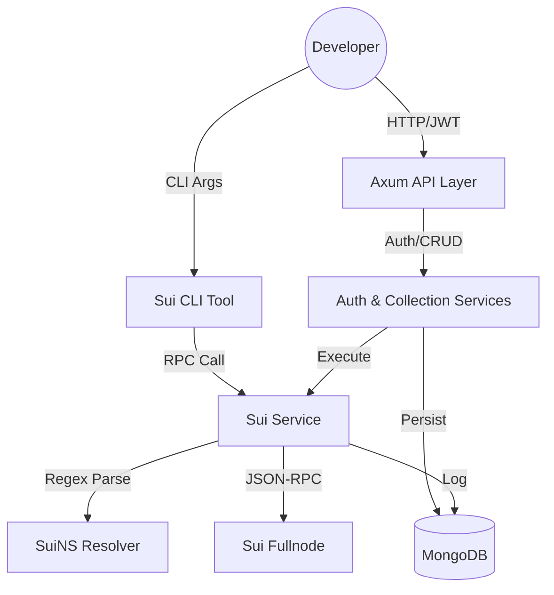

# txio Backend

[](https://www.rust-lang.org/)
[](https://github.com/tokio-rs/axum)
[](https://www.mongodb.com/)

The API behind txio. Caches RPC traffic, persists collections, handles auth, resolves names — and serves the CLI and dashboard from the same surface.

Think Postman, but it speaks Sui (and a few others) natively.

---

## How it fits together



---

## Why these choices

### Rust + Axum

Blockchain calls juggle complex hex addresses and Move types. Rust's type system catches the "invalid address" class of bugs before the code ships, and Tokio handles fanning out to dozens of fullnodes without breaking a sweat.

Axum sits on top of `tower`, so middleware for CORS, logging, and state is standardized — we're not reinventing it.

### MongoDB

RPC `params` and `result` shapes change all the time. A document store fits — no migrations every time Sui ships a new method. Same goes for the `rpc_logs` collection: heterogeneous entries, no schema fights.

### Repository pattern

Queries live in `src/repositories/`. Business logic lives in services. Swap the DB someday? Touch one layer, leave the rest alone.

### Regex-based SuiNS resolution

Most resolvers do exact string matches. We use a recursive scan: `r"([a-zA-Z0-9-]+\.sui)"`. Why? Devs embed names inside Move type tags — `0x...::Coin<names.sui>` — and a flat string match misses them. The regex catches every occurrence before the call goes out.

### Standardized error envelopes

When a node goes down or a name fails to resolve, most tools throw a raw HTTP error or a CLI panic. We wrap everything in valid JSON-RPC 2.0 error envelopes, so frontends don't need separate code paths for "network error" vs "RPC error" — they all arrive in the same shape.

---

## What you get

### Collections, Postman-style

Organize RPC calls into folders. Each request remembers its config and execution history — no more `curl` archaeology in your bash history.

### Global network switching

Set Mainnet, Testnet, or Devnet once. It sticks across CLI and API. Persisted on the User model so your tools stay in sync without per-command flags.

---

## Data models

### SavedRequest

```json
{
  "_id": "ObjectId",
  "name": "String",
  "method": "String",
  "params": "JSON Value",
  "last_response": "Optional JSON Value",
  "last_executed_at": "Optional DateTime"
}
```

---

## sui_cli

```bash
cargo run --bin sui_cli -- -m sui_getChainIdentifier --pretty
```

Flags:
- `--method`, `-m` — RPC method.
- `--params`, `-p` — JSON array of args.
- `--pretty` — syntax-highlighted output.

---

## Environment

| Variable | What it's for |
| :--- | :--- |
| `MONGO_URI` | Database connection |
| `JWT_SECRET` | Signs auth tokens |
| `BREVO_API_KEY` | Sends OTP emails via Brevo |
| `GROQ_API_KEYS` | Comma-separated Groq keys for the AI Console |
| `GROQ_MODEL` | Groq model ID for the AI Console |

---

> [!IMPORTANT]
> Fail-fast: inputs hit `validator::Validate` before any service layer touches them.

> [!TIP]
> Internal RPC errors live in the `-32000` to `-32002` range. Full registry is in `walkthrough.md`.

## License

MIT. See [LICENSE](LICENSE).
