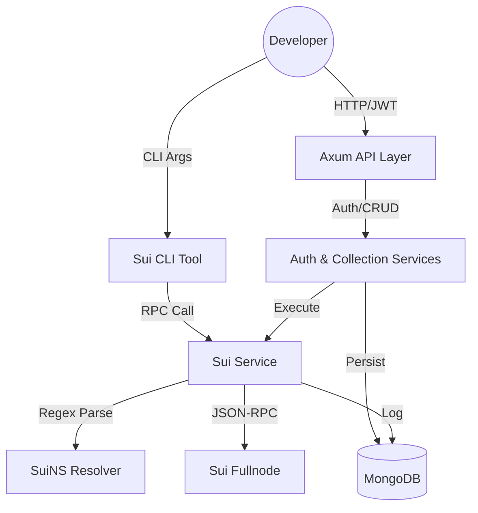

# 🌊 Flow Backend: Sui RPC & Collection Manager

[](https://www.rust-lang.org/)
[](https://github.com/tokio-rs/axum)
[](https://www.mongodb.com/)

> **Flow Backend** is a purpose-built gateway for Sui blockchain developers. It combines the power of a decentralized network with the developer experience of modern API tools like Postman.

---

## 🏗️ Architecture & Flow



---

## 🧠 Philosophy: The "Whys" Behind Flow

### 1. Why Rust & Axum?
Traditional web backends often sacrifice performance for speed of development. We chose **Rust** because:
- **Type Safety**: Blockchain interactions involve complex hex addresses and Move types. Rust's strict type system prevents "invalid address" bugs at compile time.
- **Concurrency**: Handing hundreds of simultaneous RPC calls to different fullnodes requires a highly efficient asynchronous runtime (**Tokio**), which Rust provides natively.
- **Axum**: We chose Axum because it's built on top of `tower`, allowing us to use standardized middleware for things like CORS, logging, and state management without reinventing the wheel.

### 2. Why MongoDB?
In blockchain development, RPC parameters and responses are highly dynamic.
- **Schemaless Flexibility**: The `params` and `result` fields in a Sui RPC call vary wildly. **MongoDB** allows us to store these as BSON/JSON without complex relational mapping or expensive migrations every time the Sui RPC API changes.
- **Audit Logs**: Flow persists every execution in an `rpc_logs` collection. MongoDB's document-based nature is perfect for storing these heterogeneous log entries.

### 3. Why the Repository Pattern?
Flow implements a clean **Repository Pattern** (`src/repositories/`).
- **Why?**: This separates the "How" (MongoDB queries) from the "What" (Business logic inside Services). If we ever need to switch to PostgreSQL or a different DB, we only change the Repository layer, leaving the core logic in `collection_service.rs` untouched.

### 4. Why Regex-based SuiNS Resolution?
Most SuiNS resolvers only handle exact string matches. Flow uses a **Recursive Regex Scanner** (`r"([a-zA-Z0-9-]+\.sui)"`).
- **Why?**: Developers often embed addresses inside complex Move Type Tags (e.g., `0x2::sui::SUI` or `0x...::Coin<names.sui>`). A simple string match would miss these nested names. Our regex approach ensures that *every* occurrence of a `.sui` name is identified and resolved before the call is sent.

### 5. Why Response & Error Standardization?
When a node is down or a name fails to resolve, most tools return a raw HTTP error or a CLI panic.
- **Why synthesize?**: We want to provide a "Frontend-First" experience. By synthesizing valid **JSON-RPC 2.0 error envelopes** for transport failures, we ensure that integrating frontends don't need special logic for "network errors" vs "RPC errors"—they all arrive in the same standard format.

---

## � Key Technical Features

### 📁 Postman-like Collections
Organize your RPC research into logical folders. Every request persists its configuration and **execution history**.
- **Context Preservation**: Replaces the need for hundreds of `curl` commands in your bash history.

### 🌐 Global Network Switching
Switch between **Mainnet**, **Testnet**, and **Devnet** once, and it reflects everywhere.
- **Why?**: It's common to switch environments during a sprint. By persisting this in the `User` model, your CLI tool and API calls stay in sync without needing flags on every command.

---

## 📦 Data Models

### 🛰️ SavedRequest
```json
{
  "_id": "ObjectId",
  "name": "String",
  "method": "String",
  "params": "JSON Value",
  "last_response": "Optional JSON Value",
  "last_executed_at": "Optional DateTime"
}
```

---

## 💻 CLI Documentation (`sui_cli`)

### Commands
- `--method`, `-m`: RPC method.
- `--params`, `-p`: JSON array of args.
- `--pretty`: Syntax-highlighted output.

```bash
cargo run --bin sui_cli -- -m sui_getChainIdentifier --pretty
```

---

## �️ Setup & Environment

### Environment Variables
| Variable | Purpose |
| :--- | :--- |
| `MONGO_URI` | Database connection. |
| `JWT_SECRET` | Signing authentication tokens. |
| `BREVO_API_KEY` | Sending OTP emails via Brevo. |

---

> [!IMPORTANT]
> This project follows a "Fail-Fast" principle. Inputs are validated using `validator::Validate` before reaching any service layer.

> [!TIP]
> All RPC errors use the code range `-32000` to `-32002` for internal synthesis. Check the `walkthrough.md` for the full error registry.

## License

This project is open-source and licensed under the MIT License. See the [LICENSE](LICENSE) file for more details.
